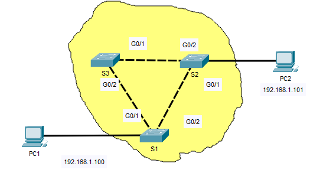
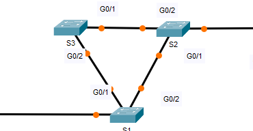
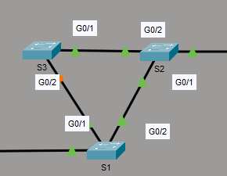

# STP Loop Prevention Practical

## Overview
In this practical lab I will be touching the surface of Spanning Tree Protocol (STP) explaining:
- Loops created in Ethernet Layer 2 switches.
- What STP is.
- How STP prevents those loops from occurring.

There is a packet-tracer file attached that I will be using to demonstrate everything, there is also a docx file with questions and answers for this practical.

## How loops are created in Ethernet Layer 2 switches?
In a network design (Hierarchical) we often create redundant paths, this implements fault-tolerance within a network. Fault tolerance is very crucial in a network because it accommodates single-point failure ensuring that the network is operating efficiently. This works perfectly with intermediary network devices such as routers because they are Layer 3 devices meaning a packet will not be alive forever if it does not finds its destination, it will eventually be dropped due to Hop-count and Time-to-Live (TTL). But with switches this is a problem because they are Layer 2 devices, they do not have the Layer 3 mechanisms like TTL. Therefore a loop is created when broadcast frames are sent and there is no implementation of STP causing the network to be unusable.  

*The shaded area of the figure below shows an example of a network design that would cause a Layer 2 loop if STP is not implemented.*

## What is STP?
STP is a network protocol that uses Spanning-Tree Algorithm (STA) to create a loop-free topology. This protocol is used in switches to ensure that they avoid Layer 2 loops caused by redundant paths within a hierarchial network.  

## How does STP prevents those loops from occurring?
Switches have STP configured within them by default. Meaning when they are connected within redundant paths network, STA mechanism will be implemented to elect the root bridge, root ports, designated ports, and blocked(alternate) ports.

STP elects a root bridge based on the lowest Bridge ID(ID) of the switches, after the Root ports and Designated ports will elected.
- **Root Port**: This is the port on non-root bridge switch with the lowest cost path to the root bridge (forwards traffic to the root bridge).
- **Designated Port**: This port forward traffic onto the next network segment (Forwards traffic away from the root bridge switch). 
- **Blocked Port**: This port only receives traffic but cannot forward any.

*The figure below shows orange links between switches meaning they are trying to elect the root bridge for the connection.*

*This figure below shows the results after the root bridge has been elected.*

### Results
 - **S2**: is the root bridge and all its ports are designated ports.
 - **S1**: G0/2 port is the root port and G0/1 port is the designated port.
 - **S3**: G0/1 port is the root port and G0/2 port is the blocked port. It can change its status if there is any change in the connection of devices e.g, The ethernet connection between S1 and S2 is removed. The frames of S1 will now use the route of S1 (G0/1) and S3(G0/2).

